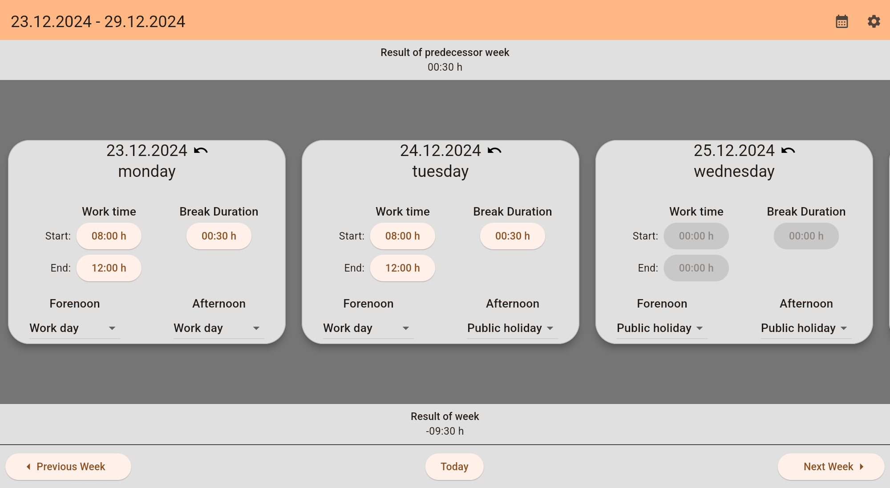
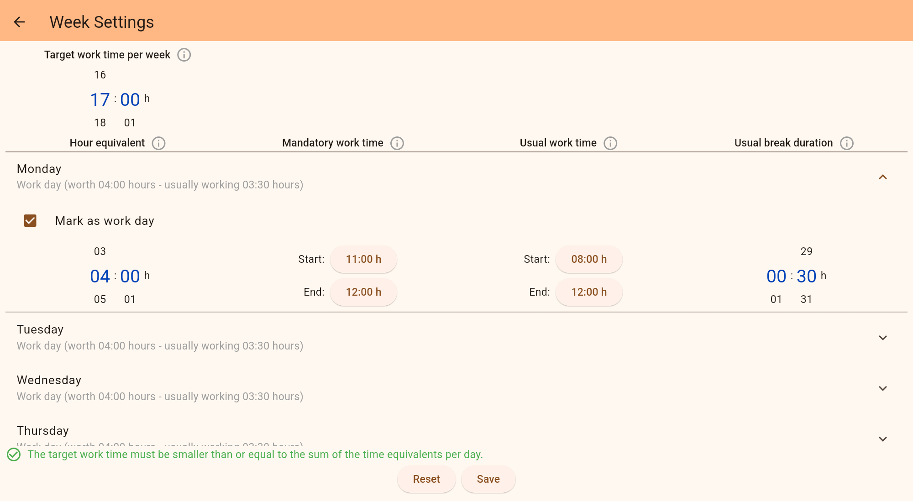
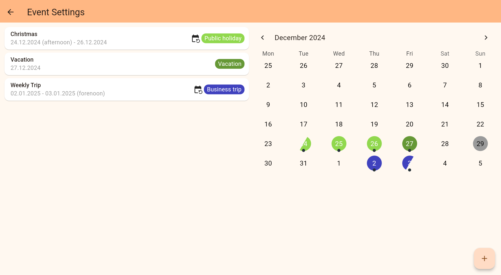

# Work Time Table

To install the application, please use the latest version of the delivered [.apk-file in the Releases folder](./Releases) to install it on a mobile device. Then the application can be launched by tapping on the application icon.

<!-- TODO: REFERENCE TO PLAYSTORE -->

The `Work Time Table` mobile application can be used to track the weekly working hours and plan regular events like public holidays or vacations.

<!-- to generate screenshots use `flutter run --flavor docs --release` -->

|                                |
| ------------------------------ |
|      |
|   |
|  |

For a feature documentation refer to the [Changelog](./Changelog.md).

When contributing to the project, refer to the [Workflows](./Workflows.md).
